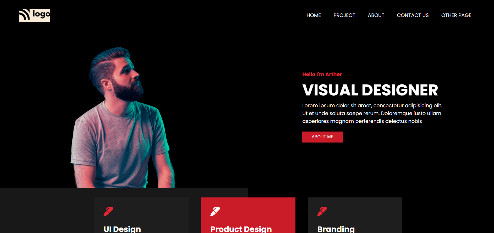

># PROJECT 15 Designer Landing Page

>This project is responsive for all devices.

>### Screenshot :
---

>### Live Preview :
---
[live link](https://shubham-live-class-project-15.netlify.app)

>### I have learned working on this project :

---
1. I learned a lot about media query and how they works.

2. I think i have improved my googling since i used google alot whenever i was stuck in this project.

3. While doing any project i should take one thing at a time.

>### Time took to finish the project :
---

It took me 7 hours to finish this project.

### About Me :
---
>I'm SHUBHAM KUMAR and i am aspiring to be a Full Stack Web Developer.

[follow_me_on_instagram](https://www.instagram.com/shubhamcoder07/)
